<a href="https://salman-ch.netlify.app">
  <picture>
    <source media="(prefers-color-scheme: dark)" srcset="./assets/terminal-dark.svg">
    <source media="(prefers-color-scheme: light)" srcset="./assets/terminal-light.svg">
    
  </picture>
</a>

### I build systems and fix the pipelines nobody wants to touch.

Software engineer @ **9D Technologies** in Lahore, Pk. I write Python and FastAPI services, the CI/CD that ships them, and the telemetry that explains them when they break. Most of my open source work lands in large, long-lived codebases: container images, build systems, CI, and the accessibility bugs everyone had learned to live with. Lately, LLM agents that are only allowed to do what they can prove.

<!--stats:start
**28** merged upstream PRs across **7** orgs · **3** in review · code in **Jenkins Weekly 2.565** and **LTS 2.568.1** -->
<!--stats:end-->

[Website](https://salman-ch.netlify.app) · [Résumé](https://salman-ch.netlify.app/resume.pdf) · [LinkedIn](https://www.linkedin.com/in/msalman199/) · [X](https://x.com/sam_env) · [Medium](https://medium.com/@msamdev) · [Email](mailto:chsalmanramzan422@gmail.com)

<!--  -->

<br>

## Career, as a trace

I debug systems by reading traces, so this is my history the way Jaeger would draw it. Each role is a span; the live ones keep growing.

<picture>
  <source media="(prefers-color-scheme: dark)" srcset="./assets/trace-dark.svg">
  <source media="(prefers-color-scheme: light)" srcset="./assets/trace-light.svg">
  
</picture>

<sub>Open any span on [the interactive version](https://salman-ch.netlify.app/#trace).</sub>

## Shipped

Every one of these is running or merged somewhere you can check.

<table>
<tr>
<td width="50%" valign="top">

**[resume builder with a real typesetter](https://qelvo.vercel.app/)** &nbsp;<sub>`upstream`</sub>

You can bring the resume you already have. **Qelvo** reads PDF, DOCX or plain text, recovers the layout (columns, dates, links, bullets), and drops it into the layout you pick. Then you edit it like code, `Overleaf-style`, or like a form. Both views stay in sync.

<sub>🚢 Made one for the real  · <a href="https://github.com/SalmanDeveloperz/qelvo">/SalmanDeveloperz/qelvo ↗</a> · <a href="https://qelvo.vercel.app/">Live ↗</a></sub>

</td>

<td width="50%" valign="top">

**[FOSSology microservices](https://github.com/SalmanDeveloperz/GSoC-2025)** &nbsp;<sub>`GSoC 2025`</sub>

Revived a branch frozen since 2021 and ran the scheduler, database and agents as 10+ services on Kubernetes, with a Kustomize base across 26 manifests. Moving from Make to CMake cut build time by 40%. The hard part was a scheduler crash loop, traced through schema limits, container networking and init ordering.

<sub>☸️ 10+ services · −40% build time · <a href="https://summerofcode.withgoogle.com/archive/2025/projects/MjOyiOj7">Final report ↗</a></sub>

</td>
</tr>
<tr>
  <td width="50%" valign="top">

**[Env var substitution in the Jenkins image](https://github.com/jenkinsci/docker/pull/2250)** &nbsp;<sub>`upstream`</sub>

Opt-in substitution for reference config in containerized Jenkins, closing a request open since 2017. I followed it with Windows parity in PowerShell: `Invoke-EnvVarSubstitution` for `.xml`, `.conf`, `.properties` and `.groovy` files, with three Pester tests.

<sub>🚢 Shipped in Weekly 2.565 and LTS 2.568.1 · <a href="https://github.com/jenkinsci/docker/pull/2250">#2250 ↗</a> · <a href="https://github.com/jenkinsci/docker/pull/2365">#2365 ↗</a></sub>

</td>

<td width="50%" valign="top">

**[PoS-OTel](https://github.com/SalmanDeveloperz/PoS-OTel)** &nbsp;<sub>`observability`</sub>

Jenkins exports traces to an OpenTelemetry Collector that keeps every failed build, every build over 30 seconds and 20% of the rest. Traces go to Jaeger; span metrics feed Prometheus and Grafana. I built it after an afternoon of correlating container logs by hand during GSoC.

<sub>📉 −81% trace data across 9 pipeline runs · <a href="https://github.com/SalmanDeveloperz/PoS-OTel">Source ↗</a> · <a href="https://salman-ch.netlify.app/#pos-otel">Simulator ↗</a></sub>

</td>
</tr>
<tr>
<td width="50%" valign="top">

**[Ezvor](https://ezvor.lovable.app)** &nbsp;<sub>`full stack`</sub>

A career platform that scores readiness only from work a judge has verified. It combines a 3,977-problem graded DSA arena with live GSoC, LFX and Outreachy status. The score is a pure function of the evidence, with no model and no network calls, so it can't be gamed.

<sub>🟢 Live · <a href="https://ezvor.lovable.app">App ↗</a> · <a href="https://github.com/ezvor/ezvor">Source ↗</a></sub>

</td>
<td width="50%" valign="top">

**[PDF Scanner Web](https://docs-scan.netlify.app/)** &nbsp;<sub>`9D Technologies`</sub>

The web side of PDF Scanner, an Android app with 50M+ installs. It has 31 document tools, including merge, compress, OCR, sign and redact, and every one runs in the browser. Files never leave the device, so there's no conversion server to run.

<sub>🟢 Live · 31 tools · 0 uploads · <a href="https://docs-scan.netlify.app/">App ↗</a> · <a href="https://github.com/SalmanDeveloperz/PDF-Scanner">Source ↗</a></sub>

</td>
</tr>

<tr>
  <td width="50%" valign="top">

**[SigNoz AI SRE](https://github.com/SalmanDeveloperz/signoz-ai-sre)** &nbsp;<sub>`LLM agent`</sub>

A self-healing loop driven by SigNoz alerts. Rules fix known failures. Unknown ones go to an LLM with two read-only tools, a three-key action allowlist and a 10-second timeout, and its proposals pass the same safety check a human's would. Every model call is a traced span.

<sub>🤖 Gemini · Claude · GPT behind one interface · <a href="https://salman-ch.netlify.app/#ai">Watch it run ↗</a></sub>

</td>
</tr>
</table>

**Also:** [this portfolio](https://github.com/SalmanDeveloperz/web), an Astro site with a working terminal and in-browser BM25 "ask my résumé" · [Stremo](https://github.com/ezvor/stremo), public-domain cinema from the Internet Archive · [RevealX](https://github.com/SalmanDeveloperz/revealX), a password-reveal extension that survives React re-renders · [AutoAccept](https://github.com/SalmanDeveloperz/AutoAccept-Facebook-Friends), a one-click friend-request extension. [Every repo →](https://github.com/SalmanDeveloperz?tab=repositories)

## Upstream

Counts come from the GitHub API and refresh daily, so nothing here is typed by hand.

<!--oss:start-->
| | Project | Merged | What I did |
| :-: | :-- | :-: | :-- |
|  | [**Jenkins**](https://github.com/jenkinsci/docker) | [5](https://github.com/search?type=pullrequests&q=is%3Apr%20is%3Amerged%20author%3ASalmanDeveloperz%20repo%3Ajenkinsci%2Fdocker%20repo%3Ajenkinsci%2Fjenkins%20repo%3Ajenkinsci%2Ftheme-manager-plugin%20repo%3Ajenkins-infra%2Fjenkins.io) | Opt-in env var substitution for the official Docker image, closing a 2017 request, then Windows parity in PowerShell with Pester tests. Both ship in **Weekly 2.565** and **LTS 2.568.1**. Keyboard-navigation and ARIA fixes in core. |
|  | [**FOSSology**](https://github.com/fossology/fossology) | [19](https://github.com/search?type=pullrequests&q=is%3Apr%20is%3Amerged%20author%3ASalmanDeveloperz%20repo%3Afossology%2Ffossology%20repo%3Afossology%2Fgsoc) | GSoC 2025: a monolith split into **10+ services on Kubernetes**, and a Make → CMake move that cut build time **40%**. Fixes in the copyright, nomos and cp2foss agents, plus all 14 weekly reports. |
|  | [**OWASP&nbsp;Nest**](https://github.com/OWASP/Nest) | [1](https://github.com/search?type=pullrequests&q=is%3Apr%20is%3Amerged%20author%3ASalmanDeveloperz%20repo%3AOWASP%2FNest) | Collaborator since Jan 2026. Focus-visible accessibility reports, the GSoC 2026 mentor list, and a security issue disclosed privately. |
|  | [**FailureTwin**](https://github.com/kaulastudies/failuretwin-ai) | [1](https://github.com/search?type=pullrequests&q=is%3Apr%20is%3Amerged%20author%3ASalmanDeveloperz%20repo%3Akaulastudies%2Ffailuretwin-ai) | Put a live LLM analysis path in front of the deterministic engine and kept the engine as the fallback, with no secrets in the client bundle. |
|  | [**sktime**](https://github.com/sktime/sktime) | [in&nbsp;review](https://github.com/search?type=pullrequests&q=is%3Apr%20is%3Aopen%20author%3ASalmanDeveloperz%20repo%3Asktime%2Fsktime) | Sporadic optimization bracket errors in `BoxCoxBiasAdjustedForecaster`. |
|  | [**NumFOCUS**](https://github.com/numfocus/DISCOVER-Cookbook) | [1](https://github.com/search?type=pullrequests&q=is%3Apr%20is%3Amerged%20author%3ASalmanDeveloperz%20repo%3Anumfocus%2FDISCOVER-Cookbook) | Edits to the DISCOVER Cookbook, the guide for inclusive conferences. |
|  | [**TYPO3**](https://github.com/TYPO3BestPractices/tea) | [1](https://github.com/search?type=pullrequests&q=is%3Apr%20is%3Amerged%20author%3ASalmanDeveloperz%20repo%3ATYPO3BestPractices%2Ftea) | Reworked the testing framework docs and removed deprecated Nimut references. |

<sub>Plus 1 more in [meshery/meshery](https://github.com/meshery/meshery).</sub>
<!--oss:end-->

<!-- <details> -->
<!-- <summary><b>Jenkins</b>: every PR, issue and review</summary> -->
###  Jenkins </b>(every PR, issue and review):
<br>

| | Change | PR |
| :-: | :-- | :-- |
| 🚢 | Opt-in env var substitution for containerized Jenkins, open since 2017 | [docker#2250](https://github.com/jenkinsci/docker/pull/2250) |
| 🚢 | Windows parity: `Invoke-EnvVarSubstitution` for `.xml`, `.conf`, `.properties`, `.groovy`, with 3 Pester tests | [docker#2365](https://github.com/jenkinsci/docker/pull/2365) |
| ✅ | Keyboard navigation scrolling in dropdowns, where off-screen items lost visual feedback. Reported in [#26357](https://github.com/jenkinsci/jenkins/issues/26357) | [jenkins#26358](https://github.com/jenkinsci/jenkins/pull/26358) |
| ✅ | Theme picker keyboard navigation via event delegation on dynamic elements, requested by the maintainer | [theme-manager-plugin#350](https://github.com/jenkinsci/theme-manager-plugin/pull/350) |
| ✅ | Broken GitHub profile link on `jenkins.io`, fixed after confirming with the affected contributors | [jenkins.io#8629](https://github.com/jenkins-infra/jenkins.io/pull/8629) |
| 🟡 | Double-clicking the search placeholder no longer blocks input. Reported in [#26389](https://github.com/jenkinsci/jenkins/issues/26389) | [jenkins#26418](https://github.com/jenkinsci/jenkins/pull/26418) |
| 🟡 | ARIA roles for screen readers on dropdown menus | [jenkins#26321](https://github.com/jenkinsci/jenkins/pull/26321) |

**Issues I opened:** [#26357](https://github.com/jenkinsci/jenkins/issues/26357) dropdown keyboard navigation, with a video repro (fixed in #26358) · [#26389](https://github.com/jenkinsci/jenkins/issues/26389) search placeholder (fix in #26418) · [#26390](https://github.com/jenkinsci/jenkins/issues/26390) breadcrumb dropdown on small viewports (I reviewed the fix, [#26391](https://github.com/jenkinsci/jenkins/pull/26391)) · [docker#2350](https://github.com/jenkinsci/docker/issues/2350) Windows parity (fixed in #2365)

**Reviews and discussions:** [review on #26391](https://github.com/jenkinsci/jenkins/pull/26391#discussion_r2885522600) · [theme-manager-plugin #354](https://github.com/jenkinsci/theme-manager-plugin/issues/354#issuecomment-3999501777) · [plugin-site-api #107](https://github.com/jenkins-infra/plugin-site-api/issues/107) · [Matrix accessibility thread](https://matrix.to/#/!pMDTuapUyVPztBFZJr:g4v.dev/$xP9OG6CPMMqEnvLz4_GdvUKoPfxrAR6DLqfrvyO8kHo) · [GSoC 2026: OpenTelemetry scaling strategies](https://community.jenkins.io/t/gsoc-2026-opentelemetry-scaling-strategies/36647/3?u=salmandeveloperz)

<sub>🚢 shipped in a release · ✅ merged · 🟡 in review · [full history →](https://github.com/search?q=author%3ASalmanDeveloperz+org%3Ajenkinsci&type=pullrequests&s=created&o=asc)</sub>

<!-- </details> -->

<!-- <details> -->
<!-- <summary><b>FOSSology</b>: GSoC 2025, week by week</summary> -->
###  <b>FOSSology </b> (GSoC 2025, week by week):
<br>

I spent a summer building a complete microservices infrastructure for FOSSology: scheduler, database and agents running in Docker and Kubernetes. It taught me distributed systems and configuration management, but mostly what happens when you don't have observability. That is the reason I later built PoS-OTel.

[Weekly reports](https://fossology.github.io/gsoc/docs/2025/microservices-infrastructure/) · [Repository](https://github.com/SalmanDeveloperz/GSoC-2025) · [Final report](https://summerofcode.withgoogle.com/archive/2025/projects/MjOyiOj7) · [Working branch `OmarAbdelSamea/GSoC/Microservices`](https://github.com/SalmanDeveloperz/fossology/tree/OmarAbdelSamea/GSoC/Microservices)

| Commit | | Date |
| :-- | :-- | :-- |
| [`1af934a`](https://github.com/SalmanDeveloperz/fossology/commit/1af934a48c449a2aacdb3bdec285a79534488db4) | `feat(core)` microservices infrastructure | 2025-06-26 |
| [`440f907`](https://github.com/SalmanDeveloperz/fossology) | `fix(scheduler)` CrashLoopBackOff and web deployment connectivity | 2025-07-02 |
| [`4fd4787`](https://github.com/SalmanDeveloperz/fossology/commit/4fd4787936081c0c8db7df8e40d57e76e123a51a) | `build` Make → CMake, missing agent Dockerfiles and deployments, rebased on master | 2025-08-26 |

| | Merged fix | PR |
| :-: | :-- | :-- |
| ✅ | `fix` invalid characters in the copyright agent URL regex | [#3212](https://github.com/fossology/fossology/pull/3212) |
| ✅ | `fix(agent-tests)` PHPUnit tests modernized for the CMake migration | [#3037](https://github.com/fossology/fossology/pull/3037) |
| ✅ | `feat(debug)` debug logging for version control commands | [#2958](https://github.com/fossology/fossology/pull/2958) |
| ✅ | `fix` URL and email false positives on example domains and specific TLDs | [#2955](https://github.com/fossology/fossology/pull/2955) |
| ✅ | `fix` nomos CLI no longer connects to the DB when it isn't needed | [#2947](https://github.com/fossology/fossology/pull/2947) |
| ⚪ | `fix(cli)` cp2foss stops silently queueing jobs for unreachable URLs (closed) | [#3314](https://github.com/fossology/fossology/pull/3314) |

| Week | Report | What happened |
| :-- | :-: | :-- |
| Bonding | [#300](https://github.com/fossology/gsoc/pull/300) | Kickoff, 1:1s with mentors Soham and Avinal, closed out #1299, local environment ready by May 31. |
| 1 | [#314](https://github.com/fossology/gsoc/pull/314) | Docker, Minikube and kubectl on Ubuntu 24.04. Rebased Omar's 2021 branch. Build failures, a stale etcd image, and the web UI serving Debian's default Apache page. |
| 2 | [#319](https://github.com/fossology/gsoc/pull/319) | Tried `bookworm-slim`, rolled back to `buster-slim`, fixed file paths, built every base image. Then `db-0` stuck in Init. |
| 3 | [#327](https://github.com/fossology/gsoc/pull/327) | Missing `libcurl` in the scheduler build, web starting before PostgreSQL, a schema crash. First working UI. |
| 4 | [#330](https://github.com/fossology/gsoc/pull/330) | Minikube → Kind for a faster loop. First implementation up for review. Scheduler still in `CrashLoopBackOff`. |
| 5 | [#340](https://github.com/fossology/gsoc/pull/340) | Crash loop fixed for good. Next: the web pod resolving PostgreSQL via `localhost` instead of the service. |
| 6 | [#346](https://github.com/fossology/gsoc/pull/346) | PHP config and DB connectivity from pod logs. Agreed the Make → CMake move with mentors. |
| 7 | [#349](https://github.com/fossology/gsoc/pull/349) | Most components building under CMake, the scheduler the last failing image. Passed the midterm. |
| 8 | [#355](https://github.com/fossology/gsoc/pull/355) | CMake on Bookworm, back to Minikube, synced with `master`. Manifests for four missing agents. |
| 9 | [#364](https://github.com/fossology/gsoc/pull/364) | Missing DB columns for the web agent, a `curl` health check for the scheduler, a clean `Dockerfile.ojo`. |
| 10 | [#365](https://github.com/fossology/gsoc/pull/365) | Scheduler partially functional. Kustomize restructure started. Consulted the original 2021 contributor. |
| 11 | [#371](https://github.com/fossology/gsoc/pull/371) | A Kustomize base with dev and prod overlays across 26 manifests. |
| 12 | [#372](https://github.com/fossology/gsoc/pull/372) | Remaining instability traced to install path mismatches. Rebuild versus incremental fix, weighed. |
| 13 | [#373](https://github.com/fossology/gsoc/pull/373) | Legacy vs modern scheduler compared, last failures traced to upstream migrations. Final report. |

**Issues:** [#3374](https://github.com/fossology/fossology/issues/3374) email notification docs for modern Debian/Ubuntu · [#2996](https://github.com/fossology/fossology/issues/2996) panel synchronization button · [all FOSSology PRs →](https://github.com/search?q=author%3ASalmanDeveloperz+org%3Afossology&type=pullrequests)

<!-- </details> -->

<!-- <details> -->
<!-- <summary><b>OWASP, sktime, aeon and the rest</b></summary> -->
### 🌎<b>OWASP, sktime, aeon and the rest</b>
<br>

- **OWASP Nest**, collaborator since January 2026. The [GSoC 2026 mentor entry](https://github.com/OWASP/Nest/pull/3605). Reported clipped focus-visible outlines ([#3561](https://github.com/OWASP/Nest/issues/3561)) and selectable search hints ([#5602](https://github.com/OWASP/Nest/issues/5602)). Disclosed a security issue privately.
- **sktime.** Sporadic bracket errors in `BoxCoxBiasAdjustedForecaster`, [#10316](https://github.com/sktime/sktime/pull/10316).
- **aeon-toolkit.** `RDSTRegressor` and `RISTRegressor` tests after Ubuntu CI verification ([#2599](https://github.com/aeon-toolkit/aeon/pull/2599)), and a notebook on aeon distances with sklearn clusterers ([#2511](https://github.com/aeon-toolkit/aeon/pull/2511)). Both closed.
- **Dragonfly.** `LMPOP` with unit tests in C++, [#3925](https://github.com/dragonflydb/dragonfly/pull/3925) (closed).
- **NumFOCUS DISCOVER Cookbook** ([#73](https://github.com/numfocus/DISCOVER-Cookbook/pull/73)) and **TYPO3 tea** ([#1480](https://github.com/TYPO3BestPractices/tea/pull/1480)): documentation.
- **Infomaniak kDrive.** Reported the sign-up flow sticking on first launch, [#1117](https://github.com/Infomaniak/desktop-kDrive/issues/1117).

[Every PR outside my own repos →](https://github.com/search?q=author%3ASalmanDeveloperz+is%3Apr+-user%3ASalmanDeveloperz&type=pullrequests&s=created&o=desc)

<!-- </details> -->

## How I build with LLMs

**Deterministic first.** Known failures take a plain `if/else`. The model only sees what the rules can't explain.<br>
**Guardrails live outside the model.** A small action allowlist, read-only tools and a hard timeout. Safety comes from a small action space, not from trusting the output.<br>
**Every model call is a span.** The model, token counts and each tool call are traced next to the infra they investigated, so cost is a query.<br>
**Fallbacks are part of the contract.** No key, a timeout or a bad answer resolves to "needs a human". In a live run, my agent found no evidence and declined to act.

<sub>From [SigNoz AI SRE](https://github.com/SalmanDeveloperz/signoz-ai-sre) and [failuretwin-ai#12](https://github.com/kaulastudies/failuretwin-ai/pull/12).</sub>

## Changelog

<!--log:start-->
```text
$ git log --oneline --graph -8
* 06ddd58  2026-09     feat   PDF Scanner Web: 31 document tools, all in the browser, for 9D Technologies
* 094c45c  2026-08-09  merge  Live LLM analysis path with the deterministic engine kept as fallback
* 61edd8f  2026-08     chore  Joined 9D Technologies as a Backend Software Engineer
* 8f79334  2026-07-20  feat   SigNoz AI SRE: self-healing loop with a guarded LLM tier
* f4e7e8b  2026-07-07  feat   Ezvor: career platform scored only on judge-verified work
* d35f0f2  2026-06-10  merge  Env var substitution for Windows containers, shipped in LTS 2.568.1
* 580fdd9  2026-05-18  merge  Closed a 2017 issue: env var substitution in the official Jenkins image
* 1c5c477  2026-03-17  feat   PoS-OTel: OpenTelemetry pipeline for Jenkins CI, 81% less trace data
```
<!--log:end-->

<sub>Synced daily from [the full changelog](https://salman-ch.netlify.app/#changelog).</sub>

## Recognition

- 🏅 **Google Summer of Code 2025**, FOSSology. Under 5% acceptance, one of a small number of Pakistani contributors that year.
- ☸️ **Linux Foundation LiFT Scholar 2025**, a full scholarship for Kubernetes for Developers (LFD259) and its exam.
- 🥇 **Byte & Battle Hackathon 2025**, 1st place university-wide and 3rd at district level, in speed programming.
- 🎓 **PEEF Scholarship**, an 80% fee scholarship from the Government of Punjab for academic merit.
- 🤝 **Dev Weekends**, mentor for developers getting into open source and GSoC.

## Writing

- [Closing a 2017 issue in the official Jenkins Docker image](https://salman-ch.netlify.app/writing/jenkins-docker-env-var-substitution/)
- [Cutting CI trace volume by 81% with tail sampling](https://salman-ch.netlify.app/writing/cutting-ci-trace-volume-81-percent/)
- [GSoC 2025 at FOSSology, week by week](https://salman-ch.netlify.app/writing/gsoc-2025-week-by-week/)
- [My Google Summer of Code 2025 journey](https://medium.com/@msamdev/my-google-summer-of-code-2025-journey-be42c1d27d7f) <sub>on Medium</sub>

## Stack


**AI:** tool-calling agents, Vercel AI SDK, Gemini · Claude · GPT, LangChain, RAG, embeddings, BM25, OpenTelemetry `gen_ai.*` tracing, NumPy, pandas, Hugging Face Transformers.<br>
**Also:** OpenTelemetry, Jaeger, SigNoz, Kustomize, CMake, JWT, Socket.io, PowerShell, HTML5.

<details>
<summary>This week in code</summary>

<!--START_SECTION:waka-->
<!--END_SECTION:waka-->

</details>

<br>

**Say hello:** [Email](mailto:chsalmanramzan422@gmail.com) · [LinkedIn](https://www.linkedin.com/in/msalman199/) · [X](https://x.com/sam_env) · [Website](https://salman-ch.netlify.app) <sub>· or run `sudo hire salman` in the terminal there</sub>
